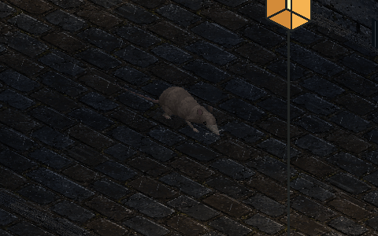

# lost.

**A little rat. A long night.** A close-up isometric pixel-art study for a short film about finding a way home through a medieval city.



This demo explores rendering, atmosphere, camera-relative movement and a rat's performance. Study 003 adds irregular, seeded exploration to a continuously articulated 3D rat, rasterized into pixel art. He mostly walks, changes pace, follows side scents and returns to his route. Wider responsive framing and larger stones establish his small size; upright street lamps light both the world and the rat, with a shadow projected from his posed mesh. World-space paw contacts drive its limbs; walking and scurrying have separate footfall schedules and body motion. Scanned weathered cobbles, generated castle masonry and researched lantern/grille sprites provide the street. Seeded grass, broadleaf weeds, rubble and soil deposits soften its edges, and the original generated rat supplies an appearance reference and fur material. The street now has a spatial soundscape: rain, crickets, foliage, distant passers, candle crackle and contact-timed paw foley. This is a motion study, not a complete movie.

## Run

Node 22 or newer:

```sh
npm ci
npm run dev
```

Open **http://localhost:4173**. After a build, `npm run serve` starts the preview without rebuilding. `PORT=4180 npm run serve` chooses another port.

The browser has **zero runtime dependencies**. TypeScript, esbuild, Sharp, tsx and Playwright Core are development tools. Generated source images are retained locally; normal builds need no image-generation service, API key, CDN or network access after `npm ci`.

## Controls

Each visit opens on a still, silent frame. Press the small centered **Play** button to start with sound. The interface stays hidden; press `H` or tap the street five times quickly on mobile to reveal it. The borderless, icon-only sound button remains available at the top right after starting. Audio downloads only after Play. Headphones reveal the stereo positioning.

| Control | Behavior |
| --- | --- |
| Centered Play | Start the scene and enable sound |
| Explore | Mostly walks with varied pace and heading, occasional scurries and scent detours; click again to rest |
| Walk / `1` | Four-beat walk, with long planted stance and low paw recovery |
| Scurry / `2` | Asymmetric gallop, with fore/hind support groups, suspension and spine flexion |
| Sniff / `3` | Stop and investigate, with head and whisker motion |
| Listen / `4` | Stop, hold alert, gently move the head |
| Groom / `5` | A small head/paw wash gesture; most readable in front/side views |
| Rest / `0` | Decelerate and settle |
| Compass | Set the exploration route, or turn while retaining a manually selected action |
| Arrow keys | Hold to guide the rat; release to stop |
| Hold/drag the street | Walk toward that screen direction; release to stop; quick touch taps leave exploration running |
| Pause / `Space` | Freeze simulation, tail, lighting and rain; suspend audio |
| Light at the end | Ease the palette from cold/lost to warmer/home |
| Rain | Toggle rain streaks and rain/drizzle sound; the street stays wet |
| Sound button / `M` | Enable or mute all audio; available at the top right after Play |
| Sound mix | Independent rain, crickets, foliage, people, candle and paw/crawl levels; zero silences a group |
| Closer | Adjust framing; starts at 90%, with extra room on narrow or short screens |
| `H` / five quick taps | Toggle the interface; the minus button also hides it |
| Motion lab | Open contact indicators, playback speed and joint overlays |
| Playback | Real time, half speed or quarter speed; simulation still uses fixed steps |
| Step 1/60 s | Pause and advance one simulation step |
| Show joints & contacts | Blue limb chains; green planted paws; amber airborne paws |
| Reset | Restore the opening scene; retain Motion lab review settings |
| Field notes | About the study and keyboard reference |
| Fullscreen icon | Toggle browser fullscreen where supported |

Space uses native activation when a button is focused. Sliders retain native keyboard controls. The scene is paused for everyone until Play is explicitly pressed. Background tabs do not accumulate simulation time and suspend audio. Reset preserves mute and mix preferences for the current visit.

WebGL is the default. `?renderer=canvas` explicitly selects the Canvas comparison renderer. Use `?paused&time=6` for a reproducible opening still. Source errors and unavailable WebGL appear visibly instead of silently rendering an empty scene.

## Check and inspect

```sh
npm run secrets:check # scan working files and reachable commits, reporting paths only
npm run check          # assets, strict TypeScript, build, Node tests, memory-rendered PNGs
npm run test:browser   # actual Chrome: WebGL/Canvas, desktop/mobile, input and controls
npm run motion         # animated gait comparisons and contact/performance measurements
npm run preview:gif    # regenerate the five-second README animation
npm run audio:preview  # actual offline Web Audio mix, isolated tracks and level metrics
npm run audio:prepare  # optional: rebuild retained WAV clips using Chrome codecs and tar
```

Browser tests use installed Google Chrome (`/Applications/Google Chrome.app/Contents/MacOS/Google Chrome` on macOS, `/usr/bin/google-chrome` on Linux). Override with `CHROME_PATH=/path/to/chrome`. Playwright Core does not download a browser. Tests start and stop their own local server; no separate preview is required.

Open **http://localhost:4173/?lab** and press `H` for live motion inspection. `artifacts/motion-study.html` plays walking and scurrying side by side after `npm run motion`; each two-second loop includes contact overlays and a scrolling diagnostic floor. `motion-metrics.json` records stance drift, support counts and CPU raster timings. These loops reset at their boundaries; they are inspection clips, not seamless animation assets.

Inspect `artifacts/browser-motion-lab.png`, `browser-webgl.png`, `browser-mobile.png`, `browser-home.png`, `rat-directions.png`, `lost-memory.png`, `home-memory.png` and `budget.json`. `npm run snapshot` recreates the software renders. The atlas remains **1536 × 1536, 9 MiB decoded**, below the 16 MiB atlas limit. Reserved **384 × 288** and **352 × 288** regions receive the live rat and its cast shadow each frame. WebGL updates those regions with `texSubImage2D`; no additional texture or runtime library is needed.

## Build and deploy

`npm run build` produces a self-contained `dist/` folder. Serve it with any static host, including under a subdirectory: all delivered references are relative and assets are content-hashed. Upload assets before `index.html`; cache hashed assets immutably and give HTML a short cache lifetime.

Upload to the same Google Cloud Storage bucket as Infinite Jungle, under **`/lost/`**:

```sh
./upload.sh --dry-run       # build and print commands; no cloud writes
./upload.sh                 # publish to gs://muthanna.com/lost/
./upload.sh --clean         # publish, wait six minutes, then prune old Lost assets
npm run upload             # same uploader through npm
```

Requires installed/authenticated `gcloud` with access to `muthanna.com` and its existing public-read setup. Each upload builds and stages a release, uploads hashed assets with a one-day immutable cache, then publishes HTML with a five-minute cache. Old assets remain unless `--clean` is supplied. Cleanup is restricted to `lost/` and aborts if the remote index changed during the wait. Serialize uploads to this prefix. See [deployment details](docs/DEPLOYMENT.md).

The existing generic uploader remains available for other buckets: `npm run deploy -- [--dry-run] gs://YOUR_BUCKET/lost`. It retains its one-year asset cache and does not prune. Script behavior is tested with a recording-only cloud CLI; creating these scripts does not deploy the site.

## Design

- [How procedural models, animation and pixel rendering work](docs/rat-design.md)
- [Strategy, rat-motion research, implementation and limits](docs/STRATEGY.md)
- [Sound design, source credits, mixing and verification](docs/audio-design.md)
- [Street artwork, reference research and terrain dressing](docs/street-design.md)
- [Assets, exact prompts, crop registration and provenance](docs/ASSETS.md)
- [Contributor guidance](AGENTS.md)

`src/model/` provides reusable geometry, materials, camera projection and pixel rasterization. `src/animation/` provides contact planning, joint solving, curves and trailing chains. `src/rat/` supplies anatomy, gait choices and appearance; `src/rat/exploration.ts` chooses seeded intentions and `src/simulation.ts` owns the actor's motor. A small plant in `src/examples/sprout.ts` demonstrates reuse and renders to `artifacts/sprout-example.png` during snapshots.

`src/world/street.ts` owns scene scale and world-space lamp fields. `src/scene.ts` composes DOM-free draw commands; `src/main.ts` owns browser lifecycle and controls. Software, Canvas and WebGL renderers share the draw-command and texture-patch contract. The camera follows the rat exactly; the street remains world-anchored and bounded in memory.

The renderer, math, quad, batch and local-server foundations were reused from [0xfe/jungle](https://github.com/0xfe/jungle), at local revision `50803498ad97b244042fb026ead4fc6fc47f2207`, as requested. Rat behavior, scene, interface and generated art are new. No license has been selected for the original work.
