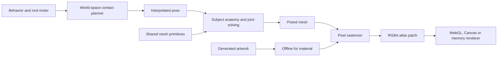

# Creating and animating procedural pixel models

## Overview

Lost's rat is a small, articulated **3D model authored in TypeScript and rendered into a pixel sprite every frame**. Its anatomy is made from mathematical shapes. Its movement comes from a simulation, contact constraints and animation curves. A software rasterizer turns the posed mesh into a transparent image; the existing WebGL renderer draws that image into the isometric street.

There are two different kinds of generation in this project. OpenAI's image generator produced the original rat reference sheet and the stone textures. Code generates the live rat's geometry and poses. No image-to-3D reconstruction, imported animal mesh, motion capture, Blender scene, external rigging package or game engine was used. The original rat images are appearance references and supply a small fur texture; they are no longer the moving body frames.

The general workflow is:

1. Establish the silhouette, scale and appearance with references.
2. Describe the subject with reusable shapes and subject-specific proportions.
3. Decide what must stay attached or in contact, then solve motion around those constraints.
4. Add secondary movement: breathing, looking, flexing, swaying and trailing parts.
5. Apply materials in model coordinates and rasterize through a fixed pixel camera.
6. Inspect motion slowly, check mechanical invariants and compare the actual rendered result.

The shared components can support an insect, plant or person. They provide geometry, materials, contacts and joint solvers; they do not prescribe a universal anatomy or gait. A plant can use the geometry and renderer without a locomotion system. A six-legged insect can use the contact planner with six homes and a different phase schedule. A person needs an authored biped rig and balance policy, even though the same two-link solver can place knees and elbows.



This document describes the implementation, its reusable parts and its limits. [STRATEGY.md](STRATEGY.md) covers the artistic direction and why the earlier four-frame approach was replaced. [ASSETS.md](ASSETS.md) records image preparation and provenance.

## Component boundaries

The reusable modules never import the rat, scene, browser UI or application simulation. Models consume shared components, rather than shared components branching on a species name.

| Location | Responsibility |
| --- | --- |
| [`src/model/vector.ts`](../src/model/vector.ts) | 3D vectors, rotations and position/normal transform types |
| [`src/model/mesh.ts`](../src/model/mesh.ts) | Mesh format; ellipsoid, segment and loft construction |
| [`src/model/material.ts`](../src/model/material.ts) | Solid colors, named scalar textures and repeat sampling |
| [`src/model/camera.ts`](../src/model/camera.ts) | Fixed 2:1 isometric projection and configurable sprite framing |
| [`src/model/raster.ts`](../src/model/raster.ts) | Mesh-to-RGBA conversion, depth, lighting and optional outline |
| [`src/model/shadow.ts`](../src/model/shadow.ts) | Project posed meshes from a point light onto a flat ground plane |
| [`src/world/street.ts`](../src/world/street.ts) | Physical scene scale, responsive framing and shared lamp illumination |
| [`src/rat/exploration.ts`](../src/rat/exploration.ts) | Seeded route-following, variable bouts and scent detours |
| [`src/animation/contacts.ts`](../src/animation/contacts.ts) | Any-count ground contacts, swing/recovery and pivot reach guard |
| [`src/animation/ik.ts`](../src/animation/ik.ts) | Two-link inverse kinematics |
| [`src/animation/curves.ts`](../src/animation/curves.ts) | Periodic accents, quintic easing and Catmull–Rom interpolation |
| [`src/animation/chain.ts`](../src/animation/chain.ts) | Planar following chain with fixed segment lengths |
| [`src/rat/types.ts`](../src/rat/types.ts) | Rat pose and action vocabulary |
| [`src/rat/locomotion.ts`](../src/rat/locomotion.ts) | Rat foot homes, gait parameters and paw-washing targets |
| [`src/rat/model.ts`](../src/rat/model.ts) | Assemble body, head, limbs and tail; return mesh and diagnostic landmarks |
| [`src/rat/body.ts`](../src/rat/body.ts), [`head.ts`](../src/rat/head.ts), [`limbs.ts`](../src/rat/limbs.ts), [`tail.ts`](../src/rat/tail.ts) | Rat-specific anatomy, attachments and pose evaluation |
| [`src/rat/materials.ts`](../src/rat/materials.ts), [`raster.ts`](../src/rat/raster.ts) | Rat palette, fur binding, sprite framing and lighting choices |
| [`src/simulation.ts`](../src/simulation.ts) | Rat behavior, root motor, fixed-step state, action blending and interpolation |
| [`src/scene.ts`](../src/scene.ts) | Street composition, model placement, shadows and diagnostic overlays |

`simulation.ts` remains the rat actor and street policy. It is deliberately not a generic creature superclass. Shared mechanisms are small functions; another actor can compose the ones it needs and own a completely different state shape.

There is a concrete non-rat example in [`src/examples/sprout.ts`](../src/examples/sprout.ts). It builds a wind-bent stem and two moving leaves with the same mesh primitives. It does not import rat state or require a fur texture. It is an isolated example, not a new character placed in the street.

## How the model is created

### The mesh contract

A `Mesh` contains a vertex array and a triangle-index array. Each vertex has:

- `p`: a 3D position;
- `n`: a surface normal, used for lighting;
- `u`, `v`: surface texture coordinates;
- `material`: an RGB base color and optional texture name.

Primitives append vertices and indices to a mesh. The material must be consistent across a triangle: the rasterizer uses its first vertex's material, while interpolating UVs, shade and depth. The mesh has no dependency on an actor, action, renderer context or DOM object.

For the rat, geometry is rebuilt from the sampled pose. This is procedural pose evaluation, not conventional vertex skinning with stored bone weights. The model returns extra landmarks—limb joints, nose, ears and spine—for diagnostics and tests. The renderer needs only the mesh.

### A small vocabulary of shapes

**Ellipsoids** start with a latitude/longitude unit sphere. Positions are scaled along three axes, translated and transformed. Normals are corrected for the ellipsoid's unequal radii before the supplied normal transform is applied. Unit sphere grids are cached by segment/ring count; posed vertices are rebuilt. Use a small, fixed vocabulary of resolutions so that this cache stays bounded.

**Segments**, exposed as `bone()`, are slender ellipsoids aligned between two endpoints. The function constructs an orthogonal frame around the endpoint axis and slightly extends the shape so neighboring parts overlap. The name refers to its use for limbs; it also draws whiskers, stems, claws and tail segments. It is not a skeletal bone object.

**Lofts** connect a series of elliptical cross-sections with triangles. A section is `{x, y, z, ry, rz}`: center position and the two radii in its YZ plane. Sections progress along local X. Normals come from the cross-section tangent and the change between neighboring sections. Loft ends are not automatically capped; the rat tapers its ends to small radii and overlaps adjoining shapes.

The primitives are intentionally modest. Broad thin ellipsoids suffice for the example leaves. A more detailed plant might introduce a leaf-surface primitive; a beetle might need segmented shell forms. Such shapes should emit the same `Mesh`, without changing the rasterizer.

### Rat silhouette and proportions

The trunk is one continuous loft, rather than a row of visibly disconnected spheres. `body.ts` defines nine profile samples, each storing `[x, centerZ, radiusY, radiusZ]`. For example, `[-.28, .32, .255, .27]` places a broad cross-section near the haunches. The profile narrows toward the shoulder and neck.

Each profile channel is interpolated with a uniform Catmull–Rom cubic. Three samples per interval, plus the final endpoint, produce 25 sections, each with 24 angular segments. Repeated endpoint samples supply the cubic's end conditions. Radius clamps prevent small interpolation overshoots from producing invalid sections.

The head combines a skull ellipsoid, a tapered muzzle loft and a small nose. Eyes and inner/outer ears are additional ellipsoids. Limbs combine thick upper segments, thinner lower segments, paws, toes and claws. Whiskers and the tail use short tapered segments. A typical rat pose has roughly 9,560 triangles; small details such as eye highlights can disappear during a blink, so triangle count is not a fixed topology guarantee.

These dimensions were authored in code to establish a readable rat silhouette. They were not measured from a scan or recovered from the generated sheet. Editing the profile or radii changes anatomy; editing gait and action curves changes performance.

## Coordinates and attachment rules

All lengths use the same arbitrary world unit. One unit is not specified as a meter or centimeter. The body-length speed readout uses an approximate 1.5-unit body length.

| Space | Meaning |
| --- | --- |
| Local anatomy | X runs noseward, Y is lateral, Z is up; shape dimensions and joint attachment points live here |
| World | Root translation, ground contacts and the tail simulation use street coordinates |
| Root-relative, world-oriented | Posed mesh vertices include body heading but omit root translation |
| Sprite pixels | The model camera projects that mesh around a fixed anchor |
| Scene pixels | The street camera follows the root and scales the sprite to match the street |

The pixel camera uses:

```text
screenX = anchorX + (x - y) * scale
screenY = anchorY + ((x + y) / 2 - z) * scale
depth   = x + y + z
```

Increasing depth is nearer. Translating along `(1, 1, 1)` leaves this projection unchanged and moves toward the camera. The sprite camera is 384 × 288 pixels, with anchor `(192, 165)` and scale 66 pixels per world unit. The street places the image at `streetScale / 66`, so feet and paving share a projection and physical scale.

Attachments are ordinary transform functions. The body supplies local deformation and heading rotation. The head attaches to the deformed neck; ear transforms attach to the head; whiskers follow the muzzle. Position transforms include translation, while normal transforms must omit it. Current child transforms are rotations. If adding nonuniform scaling or shear, supply the appropriate inverse-transpose normal transform rather than applying the position transform to normals.

This small hierarchy is explicit in code. There is no hidden scene graph or general skeleton engine.

## Animation: constraints before decoration

### Fixed simulation, continuous presentation

The actor advances at 60 Hz. Time is supplied to `Rat.update(dt)`; animation does not read the wall clock or use unseeded randomness. The browser's `FixedClock` may perform several updates in one rendered frame, then `Rat.sample(alpha)` interpolates between the previous and current states.

Position, heading, unwrapped stride phase, action weights, head yaw, paw positions and tail points are interpolated. Discrete state such as the gait name and contact flag comes from the current update. Geometry is evaluated after interpolation, which avoids snapping the whole model between simulation ticks. Angle interpolation takes the short angular path.

Only actual root displacement advances the stride. A paused or wall-blocked rat does not keep cycling through walking poses. Action weights approach their targets exponentially, using `1 - exp(-rate * dt)`, so sniffing and grooming blend into and out of locomotion.

### The root motor

The rat turns toward a requested heading, with a maximum turn rate of 2.8 radians/s. It accelerates at 5.5 world units/s² and decelerates at 9. It begins cruising when the heading error is small; larger errors stop translation while it reorients. The normal scene also constrains the root to the street corridor.

These are rat and scene policies, not part of `rasterMesh()` or the mesh definition. An insect may turn differently; a plant has no translating motor at all.

### Exploration and irregular timing

`Exploration` produces an intention—action, heading, speed multiplier, performance tempo and gaze—without directly moving the root or paws. The motor and contact planner still enforce acceleration, turning and stance constraints. Seeded event choices determine what happens next; smooth seeded noise varies pace and attention within a bout. This avoids choosing a new random direction every frame and remains reproducible at any presentation rate.

The phases are `travel → notice → approach → investigate → return`, with ordinary pauses interspersed between travel bouts. Travel lasts 1.6–5.2 seconds, usually walking; 14% of travel-bout choices request scurry. Small heading deviations surround the selected route, with cross-track correction and corridor avoidance. Pace has both slow variation and brief hesitations. The compass changes that route while keeping exploration active; a manual action takes over.

After at least two travel bouts, some bouts detect an authored scent point to either side. The rat first notices it, then scurries toward it and brakes into a walk. Near the target he sniffs and changes gaze for 1.2–3.3 seconds, then returns to a saved point on his route. Approach and return have nine-second escape timers so an awkward turn cannot strand him. These are invisible behavioral targets, not simulated odors or a navigation mesh. Pauses last .35–1.95 seconds and choose sniff or listen. The ratios describe choices, not exact screen-time percentages: turning and braking take time too.

A separate `motionTime` integrates a smoothly varying `tempo`. It drives breathing, head movement, ear flicks, whiskers and blinking, including during manual sniff/listen. Exploration requests roughly .6–1.65 times normal performance speed. Locomotion remains distance-driven: changing attention tempo cannot speed up planted feet or slide them across the stones.

### Ground contact planning

`createContacts(root, homes)` accepts any number of local contact homes. `updateContacts()` receives those homes, a gait pattern, recovery settings and an optional gesture-target callback. There is no four-leg assumption or rat action vocabulary inside the planner. Its arrays must have matching lengths. Supply positive stride/recovery lengths and durations, phase offsets in `[0, 1)`, and stance fractions between zero and one.

Each contact stores its world position, landing target, departure position, foot heading, phase endpoints, progress and mode. Modes are stance, stride, recovery and gesture.

For each contact, `fraction(stride - offset)` determines its place in the cycle. The duty factor is the fraction of the cycle assigned to stance. During stance, the contact's world position is unchanged. During swing, only the airborne target may move: the planner predicts the root's remaining forward displacement and adds half the expected stance excursion to find a landing position.

Horizontal recovery uses the quintic easing function `6t⁵ - 15t⁴ + 10t³`. Vertical clearance uses `sin²(πt) * lift`, in addition to easing any initial height down to the ground. Both avoid abrupt endpoint velocities. When progress reaches one, the paw is planted again.

On stopping, airborne stride contacts finish a short time-driven recovery. If a planted foot is too far from its new neutral position, recovery replants it; only one reach-triggered recovery starts at a time. The pivot guard prevents further root rotation when a planted paw would exceed the configured reach. This lets the rat unload and replant instead of spinning over four fixed feet.

The invariant is stronger than matching animation speed to ground speed: **a planted paw and its patch of paving are the same world-space anchor**. Camera motion moves both together. Pixel sampling still quantizes their displayed positions.

### Two different gaits

The rat's homes are ordered LF, RF, LH, RH. Fore homes are at X `+.34`, Y `±.16`; hind homes are at X `−.34`, Y `±.21`.

| Setting | Walk | Scurry |
| --- | --- | --- |
| Nominal root speed (exploration varies it) | 1.25 units/s | 4.1 units/s |
| Distance per full cycle | .50 | .94 |
| Phase offsets, LF/RF/LH/RH | .22 / .72 / 0 / .50 | 0 / .08 / .49 / .55 |
| Stance fractions | .70 each | .30 fore, .32 hind |
| Paw clearance | .065 | .15 |
| Steady support pattern | Two or three contacts | Zero, one or two contacts |

Walking is a staggered four-beat lateral sequence. Scurrying uses an asymmetric gallop with closely spaced fore contacts, then hind contacts and brief suspension. Scurry is not a speed multiplier on a walking clip.

The actor changes gait schedules at a cycle boundary or rest. An active swing retains its phase endpoint, while its landing estimate uses the current gait. Body gallop effects blend toward the new gait rather than switching instantly. These schedules and coefficients are authored animation choices, informed by the research below; they are not fitted biological measurements.

### Solving limbs around the contacts

The body pose gives each limb a hip or shoulder point. Its world-space paw anchor is converted to root-relative coordinates. An ankle offset accounts for the paw's forward extent. A small forelimb shoulder glide follows reach.

`solveTwoLink()` then locates an elbow or knee using the two segment lengths, the endpoint distance and a pole direction. For endpoint distance `d` and lengths `a` and `b`, the joint's distance along the endpoint axis is `(a² - b² + d²) / (2d)`. Its perpendicular displacement is `sqrt(a² - along²)`. The pole chooses which way it bends.

Rat forelimb lengths are `.205` and `.235`; hindlimb lengths are `.255` and `.26`. Fore elbows bend backward, while hind knees bend forward. Paws retain their planted heading while the body turns around them.

This solver returns a joint position; it does not move endpoints, enforce joint-angle limits or make an unreachable target reachable. It clamps singular distances for numerical stability. Callers must supply reachable targets and a nonparallel pole to preserve both segment lengths. The rat's reach guards, recovery steps and tests enforce that contract for its motion.

### Trunk, head and small movements

The trunk combines low-amplitude walking sway and breathing with stronger gallop effects. Galloping introduces approximately ±11.5% longitudinal stretch, a gathered arch and vertical motion. Above 3.3 units/s, these body effects gain up to another 16%, reaching their cap at 4.9 units/s; joint solving still respects the same planted contacts. Shoulder and hip attachments follow these deformations, while planted paws remain on the ground. This combination makes the limbs flex around support rather than bobbing the whole animal as a rigid object.

Head pitch combines baseline posture with sniff, listen and groom weights. Head yaw anticipates requested turns and adds a slow scan at rest. Sniffing adds quicker small nose movement. The ears have separate 4.7- and 6.1-unit performance-clock accent schedules; blinking uses a 5.3-unit schedule. Their wall-clock intervals vary with attention tempo. The shared `pulse()` produces brief sine-squared accents. These deterministic curves and seeded timing changes are authored performance, not a physiological model.

Whiskers are five three-segment chains on each side. They follow the head transform and sweep with different left/right phases. Paw washing is a rat-specific gesture callback: it releases the fore contacts, raises them toward the muzzle and lets the generic recovery mechanism return them afterward.

### Tail and trailing appendages

The tail simulation is a planar chain of 19 points, with 18 segments of length `.062`. The root follows the rump. Each downstream point approaches a caller-supplied rest direction, then is projected back to the required distance from its parent. The rat supplies a slowly varying bend and a smaller stride-related offset.

The shared chain mechanism does not know that it is a tail. It could support another planar trailing appendage. The rat's tail mesh separately adds height near the pelvis, taper and skin color. This is a damped positional follower, not a spring-mass simulation; it has no inertia solver, ground friction or wall collision. A freely moving 3D antenna or vine would need an extended solver, not a claim that this planar one already supplies that behavior.

## Texturing, light and pixel rendering

### From generated art to a material

The original reference sheet is retained in `assets/source/rat.png`. During `npm run assets`, Sharp extracts a 65 × 48 crop at `(80, 87)` and samples it to 32 × 32 with nearest-neighbor filtering. RGB becomes luminance using weights `.30`, `.59`, `.11`.

The crop is divided by its mean luminance. Its contrast is reduced to `1 + (value / mean - 1) * .40`, clamped to `.84…1.16` and rounded to hundredths. This produces a scalar brightness texture rather than a full-color fur photograph. It reduces the reference's painted light/dark variation so the model's own lighting can dominate. It is not a full removal of baked illumination.

`Material` stores a base RGB color and an optional texture name. The rat uses `fur` for hairy surfaces, with a warm brown base `[139, 117, 95]`; skin, eyes and claws use solid materials. The raster wrapper binds that name to the 32 × 32 scalar array. Another model can supply other names, dimensions and independent U/V repeat rates, or use no texture at all.

### Stable UVs

Sphere UVs follow longitude and latitude. Loft UVs follow section index and angular position; the longitudinal coordinate spans 0 to 2. The rat fur binding repeats three times per UV unit. Sampling is nearest-neighbor and wraps negative coordinates correctly.

UVs are attached to the generated surface and interpolated inside each triangle. Texture therefore follows the model as it moves; it is not noise sampled from screen coordinates. Materials do not currently support RGB bitmap maps, normal maps, transparency inside the surface or physically based reflectance. Those can be added to the shared material/raster contract if a future model needs them.

### The small software rasterizer

`rasterMesh(mesh, camera, style, textures)` allocates RGBA pixels and a floating-point depth buffer. It projects vertices, computes their diffuse lighting, and scans each triangle's pixel bounding box. Barycentric weights at pixel centers interpolate depth, shade and UVs. The nearest triangle wins the depth test, so the far legs disappear correctly behind the body regardless of triangle submission order when depths differ.

The standalone rat wrapper and diagnostic studies use a normalized directional light `[-.7, -1, 2.2]`, ambient .52 and diffuse .52. The street overrides these with much lower ambient light (`.24 + mood * .07`), a weak directional moon (.16), and nearby point lights. Each point light adds `max(0, normal · directionToLight) * power * exp(-1.35 * (horizontalDistance / radius)²)` at a vertex. Shade is multiplied by the scalar fur texture and rounded to 24 steps. A scene tint becomes warmer near lamps. This is authored diffuse lighting, not ray tracing or a measured material BRDF.

An optional one-pixel, four-neighbor outline is added around opaque pixels. The standalone rat outline is `[50, 44, 38, 160]`; the night scene uses `[18, 23, 29, 125]`. There is no antialiasing pass, blur, temporal noise or crossfade between unrelated body images. The scene's lower internal resolution and nearest-neighbor display scaling make the pixel structure visible.

### From model pixels to the scene

The live rat occupies a reserved atlas region at `(800, 600)`, size 384 × 288. Its cast shadow uses `(1184, 600)`, size 352 × 288. `scene.ts` emits two `TexturePatch` objects and corresponding draw commands. The generic frame contract permits multiple patches; adding another model requires a separate nonoverlapping region and its own draw command.

WebGL updates the region with `texSubImage2D`, then draws the scene in its existing painter-ordered batch. Canvas updates its atlas canvas and invalidates overlapping tinted copies. The memory renderer updates the same atlas bytes before software compositing. The rat rasterizer does not call WebGL, and the renderers do not know about rats.

Rat self-occlusion happens inside its z-buffer. Occlusion between separate scene objects still depends on scene draw ordering; this is not a shared 3D world depth buffer. Contact shadows and the projected cast shadow are separate scene commands, not part of the model texture.

The atlas remains 1536 × 896, or 5.25 MiB decoded. Its 16 MiB budget covers the atlas, not all process memory: posed mesh arrays, depth/RGBA buffers and temporary copies also exist. The current one-character raster cost is measured by `npm run motion`. More characters may justify scratch-buffer reuse, pose caching or GPU rasterization, but none is required merely to define a new model.

### Street scale, lighting and shadows

The actor and all world features use the same scene projection. The default zoom is .9; narrow/short viewports also multiply scale by `min(1, width / 700, height / 440)`. The root stays horizontally centered and vertically near the middle (.46–.51 of viewport height, depending on aspect). The model is not independently shrunk: that would separate its rendered paws from their world contacts. Wider framing supplies breathing room while larger paving and masonry establish a small animal's surroundings.

The 256-pixel paving image repeats every six world units, twice the earlier span. Castle masonry spans eight units horizontally and six vertically. Ground lighting uses 1.5-unit cells and 64-pixel subregions of the original texture, so enlarging the stones does not require coarse lighting. Each cell's four corners sample the same lamp field; the renderers interpolate RGB across the two quad triangles. Canvas bakes those tints into small cached texture crops; the cache remains bounded. Its corner-color path currently supports standard-UV, unflipped affine textured surfaces, which is what this street uses.

Freestanding iron lamp posts alternate between street edges every 14 units. Each has a stone plinth, upright shaft, collars, enclosed amber lantern and peaked cap, reaching 8.73 units high. Their positions and mild deterministic flicker drive both masonry/paving tint and the rat's point lighting. A 5.3-unit falloff radius leaves darker gaps between warm pools. Dim blue ambient illumination keeps the silhouette legible away from lamps. The Home control warms the ambient palette but does not erase these pools.

`rasterShadow()` projects the current mesh from the strongest nearby lamp onto `z = 0`. For light `L` and vertex `P`, the intersection is `L + (P − L) * L.z / (L.z − P.z)`. It then rasterizes the projected triangles into a separate transparent black patch through the same camera and registration as the rat. This reusable helper assumes the light is above the whole mesh. Shadow opacity follows lamp strength; small contact masks supply grounding in the darkest gaps.

The cast silhouette changes with pose and light direction. Only the dominant lamp casts a rat shadow; transitions between dominant lamps can change its direction. There are no wall shadow maps, inter-object light occlusion, penumbrae, terrain heights or bounced light. Lamp posts have a small contact shadow, not a full projected shaft shadow. These are deliberate flat-street approximations, not physical light transport.

## Creating another subject

Start with a pure function from a small pose object to a `Mesh`. Keep its proportions, motion choices and materials in its own folder. Do not add species branches to the shared geometry or rasterizer.

The existing sprout example can be rendered directly:

```ts
import { sproutModel } from '../src/examples/sprout';
import { rasterMesh } from '../src/model/raster';

const mesh = sproutModel({ time: 1, wind: .3, heading: .4 });
const pixels = rasterMesh(mesh,
  { width: 128, height: 128, x: 64, y: 105, scale: 85 },
  {
    light: [-1, -1, 2], ambient: .5, diffuse: .5,
    shadeSteps: 16, tint: [1, 1, 1], outline: [35, 49, 29, 150],
  });
// pixels is a PixelImage: render it headlessly or put it in a reserved atlas region.
```

`npm run snapshot` writes this example to `artifacts/sprout-example.png`. Its simulation input is only time, wind and heading. A fixed root anchors the stem, wind bends the sampled stem positions, and the leaves have separate angular motion. The example is also exercised by the tests.

For a walking subject, define its contact homes and supply a `GaitPattern` with one offset and duty factor per contact. Own its root motor, reach policy and transitions outside the planner. Then attach limbs to the contacts with suitable joint lengths and poles. The shared tests exercise two- and six-contact plans; this demonstrates the API's independence from four rat paws, not a finished human or insect gait.

For plants, start with rooted transforms and wind-driven curves. For bugs, start with shell/segment geometry and a reference-appropriate leg schedule. For people, account for upright balance, heel/toe roll, pelvis motion, spine, arms and joint limits. Reusing low-level components does not remove the need to design those performances.

Integrate only after inspecting all headings and action extremes. Reserve enough sprite space for extended limbs and appendages, choose the model anchor, add a nonoverlapping atlas region, and preserve world/sprite scale. Keep the actor and builder DOM-free so the same pose can be rendered in tests and in the browser.

## Verification and limits

[`tests/fixtures/rat-reference.json`](../tests/fixtures/rat-reference.json) stores reviewed state and RGBA hashes for eight manual-action stages and three presentation fractions (0, .5, 1). The original fixture proved that component extraction preserved revision `878c9f6`. Study 003 intentionally refreshes those values for variable performance tempo and speed-dependent gallop exaggeration; the fixture records that reason and the prior reference revision. These are exact local regression samples, not an exhaustive proof of every possible pose or platform.

Other tests check contact locking, limb lengths, distinct support patterns, stopping and turning, deterministic output, sprite bounds, non-rat rendering, rectangular textures, depth ordering and import boundaries. The headless examples produce actual pixels. Browser tests exercise WebGL and Canvas, desktop/mobile viewports and Motion lab controls. Headless WebGL uses SwiftShader, so this is not a performance guarantee for every physical GPU.

Run:

```sh
npm run check          # build, type-check, tests and software snapshots
npm run test:browser   # actual browser rendering and controls
npm run motion         # animated comparisons, support data and CPU timings
```

Use `/?lab` to inspect quarter-speed movement, one-step advances, paw contacts and joint overlays. Judge the unobstructed silhouette as well as the diagnostic lines. Passing mechanical tests does not itself establish believable acting.

Current limits include authored rather than measured anatomy; kinematic rather than force-based locomotion; flat ground contacts; approximate shoulder/spine movement; planar tail dynamics; opaque materials; no general skeletal skinning or animation importer; and simplified grooming. Exploration adds authored behavior around these mechanical limits; it does not remove them. Future refinements should improve the subject-specific model and performance while retaining the shared contact and rendering contracts.

## Tools, provenance and references

### Artwork and implementation

- **OpenAI `image_gen.imagegen`** generated the rat reference, cobbles and masonry on 2026-10-06. The exact inputs are retained in [`assets/prompts.json`](../assets/prompts.json) and [`assets/transparency-edit.json`](../assets/transparency-edit.json). [`assets/provenance.json`](../assets/provenance.json) records hashes of the retained originals. The record identifies the tool, not an underlying model version, so no more specific generator model is claimed.
- **[0xfe/jungle](https://github.com/0xfe/jungle/tree/50803498ad97b244042fb026ead4fc6fc47f2207)** supplied the math, quad, rendering/batching and local-server foundations used by the original Lost demo. It also supplied the engineering approach: fixed-step simulation, shared headless/browser rendering, bounded atlases and offline assets.
- The rat anatomy, contact planner, mesh primitives, IK implementation, small 3D rasterizer and plant example were authored in TypeScript for Lost during the coding sessions. Catmull–Rom interpolation, barycentric rasterization, dot-product shading and two-link IK are standard mathematical techniques implemented here; no third-party implementation of these model components or animal rig was imported.

### Development tools

All package dependencies are build/test tools; the delivered browser application has no runtime package dependencies. Exact resolved versions and transitive dependencies are in [`package-lock.json`](../package-lock.json).

| Tool | Actual use |
| --- | --- |
| [TypeScript](https://www.typescriptlang.org/) | Strict type checking of application, model and test code |
| [esbuild](https://esbuild.github.io/) | Bundle TypeScript into the static browser build |
| [Sharp](https://sharp.pixelplumbing.com/) | Offline source extraction, resampling, atlas PNGs, snapshots and animated WebP encoding |
| [tsx](https://github.com/privatenumber/tsx) | Run TypeScript scripts and tests in Node |
| [Playwright Core](https://playwright.dev/) | Automate the locally installed Chrome for browser tests |
| [Node.js](https://nodejs.org/) and [Node type definitions](https://github.com/DefinitelyTyped/DefinitelyTyped/tree/master/types/node) | Scripts, local server, built-in test runner and development types |

WebGL and Canvas are browser APIs, not added rendering libraries. Sharp and Playwright do not participate in live character animation. No font pack, stock animal animation or external 3D model is shipped. See [ASSETS.md](ASSETS.md) for the original-work distribution status.

### Motion research

These sources informed animation choices; their figures, datasets and motion clips are not bundled into the application, and the code does not reproduce a fitted biomechanical model.

- [*Spinal control of locomotion before and after spinal cord injury* (2023)](https://pmc.ncbi.nlm.nih.gov/articles/PMC10055332/): rat locomotion includes different speed-dependent alternating and non-alternating gaits. This supports separating walking and galloping schedules rather than treating speed as a clip playback setting.
- [Bonnan et al., *Forelimb Kinematics of Rats Using XROMM* (2016)](https://pmc.ncbi.nlm.nih.gov/articles/PMC4775064/), DOI `10.1371/journal.pone.0149377`: crouched forelimb posture and the contribution of proximal movement informed bent limbs and a gliding shoulder attachment. The simplified rig does not implement all the measured long-axis rotations.
- [Towal and Hartmann, *Right–Left Asymmetries in the Whisking Behavior of Rats Anticipate Head Movements* (2006)](https://pubmed.ncbi.nlm.nih.gov/16928873/), DOI `10.1523/JNEUROSCI.0581-06.2006`: asymmetric exploratory whisking informed separate left/right phases and head-following whiskers. The current oscillators are authored accents, not a fitted sensory model.

- [*Coordination of Orofacial Motor Actions into Exploratory Behavior by Rat* (2017)](https://pmc.ncbi.nlm.nih.gov/articles/PMC5653531/): coordinated nose/head and breathing actions informed a separate, variable attention clock.
- [*Multiple Modes of Phase Locking between Sniffing and Whisking during Active Exploration* (2013)](https://pmc.ncbi.nlm.nih.gov/articles/PMC3785235/): motivated varying sniff/whisk performance instead of looping every exploratory pause identically.
- [*Flexible Coupling of Respiration and Vocalizations with Locomotion and Head Movements in the Freely Behaving Rat* (2016)](https://pmc.ncbi.nlm.nih.gov/articles/PMC4976156/): supports treating exploratory head activity and locomotion as related but independently variable. The bout durations, scent locations and tempo ranges here remain authored choices.
